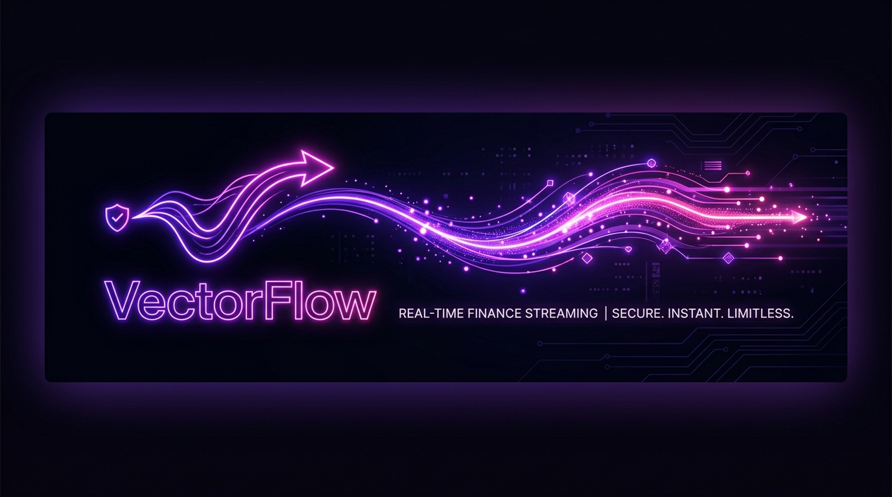
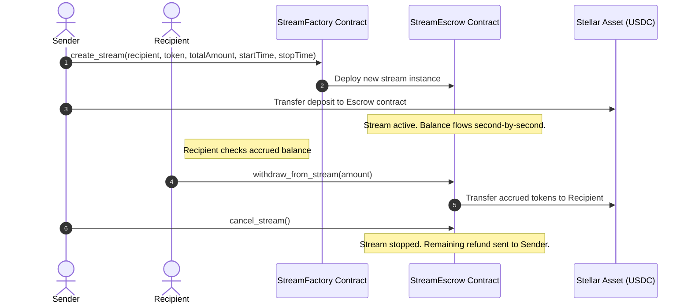

# VectorFlow 💫



> Decentralized continuous token streaming & real-time payroll protocol on Stellar (Soroban).  
> **流 - Stream payments second-by-second. Low fees, instant access, absolute control.**

[](https://github.com/elenajoyce/vector-flow-core/actions/workflows/ci.yml)
[](https://opensource.org/licenses/MIT)

---

## 💡 What it is

VectorFlow is a decentralized payment streaming protocol built on Stellar's high-performance smart contract engine (**Soroban**). It allows senders to stream assets (like XLM or USDC) continuously, second-by-second, to any recipient. 

The recipient's balance increases continuously in real-time, and they can withdraw any accrued portion of their streaming balance at any second. There are no custodial middle-men, deposit delays, or administrative keys.

**Status**: Active on Stellar testnet. Full SDK integration and React dashboard live. Pre-production ready.

### Why Stellar?
Continuous streaming requires frequent micro-updates and micro-claims. On high-gas chains (like Ethereum), streaming second-by-second is economically impossible for standard payroll or billing. Stellar's sub-cent transaction fees and fast block times make it the optimal host for real-time value transfer.

---

## ⚙️ How it works

VectorFlow uses locked escrow contracts where the claimable balance is determined dynamically on-chain using the formula:
$$\text{Claimable} = \frac{\text{Total Amount} \times \text{Elapsed Time}}{\text{Total Duration}} - \text{Withdrawn Amount}$$



### Trust model
- **Deposited Funds**: Locked securely in the stream escrow contract. Only the recipient can claim the accrued flowing portion.
- **Cancellation**: Senders (and recipients) can cancel the stream at any time. When cancelled, the accrued portion is disbursed immediately to the recipient, and the unflowed balance is returned directly to the sender's wallet.
- **No Admin Backdoors**: The contract contains no admin escape hatch or master keys. Once a stream is created, its mathematical release schedule is immutable.

---

## 📂 Repository Layout

```text
contracts/          Soroban Rust contract — StreamEscrow + StreamFactory
packages/
  sdk/              @vector-flow/sdk — client wrappers, simulation projections, and Freighter hooks
  config/           @vector-flow/config — Zod schema validation
coordinator/        SQLite caching API (indexing streams, metadata, projected balances)
relayer/            Soroban event polling relayer (syncing ledger events with SQLite)
frontend/           React + Vite dashboard (Flow counters, stream creator, charts)
docs/               Metadata, operations, and development manuals
```

---

## 🚀 Quick Start

1. Install dependencies:
   ```bash
   pnpm install
   ```
2. Copy environment file:
   ```bash
   cp env.example .env
   ```
3. Build shared packages:
   ```bash
   pnpm build:config
   pnpm build:sdk
   ```
4. Run compiler and build services:
   ```bash
   pnpm build
   ```
5. Start local services:
   ```bash
   pnpm dev:coordinator
   pnpm dev:frontend
   ```

---

## License
MIT. See LICENSE.
